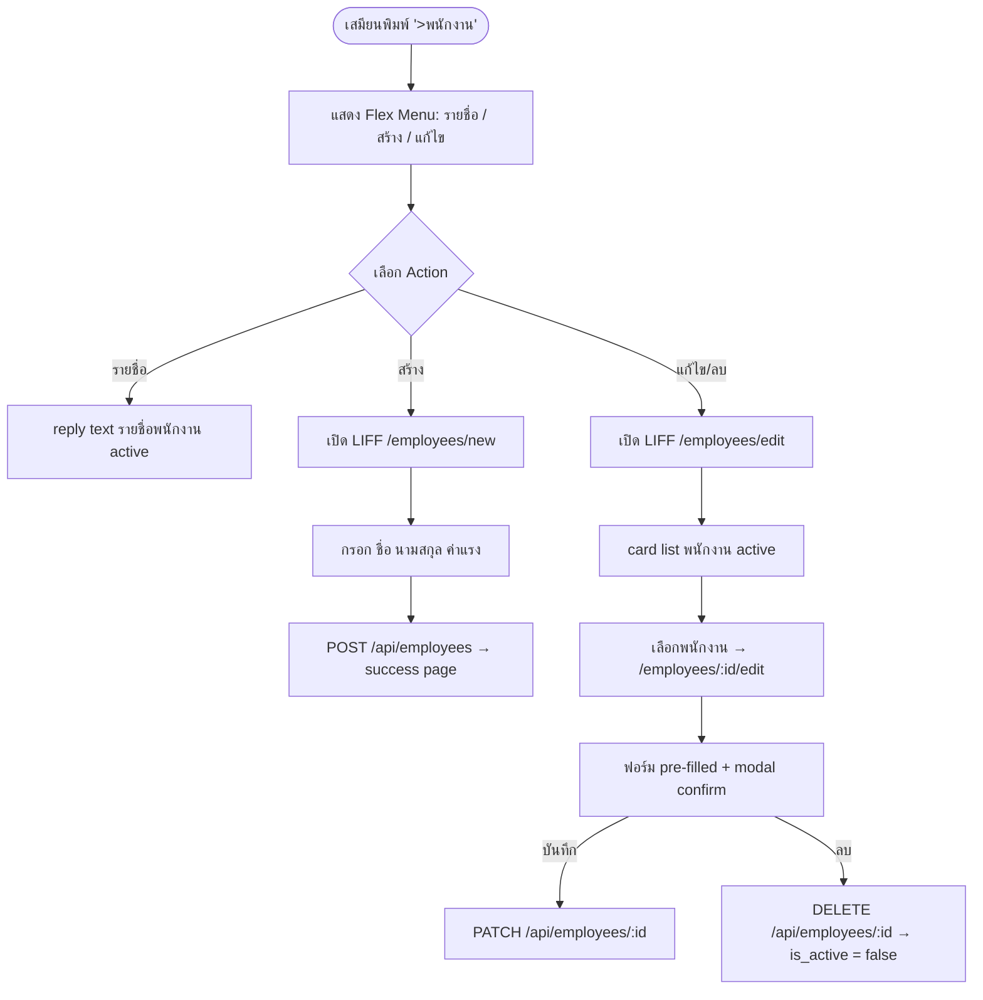
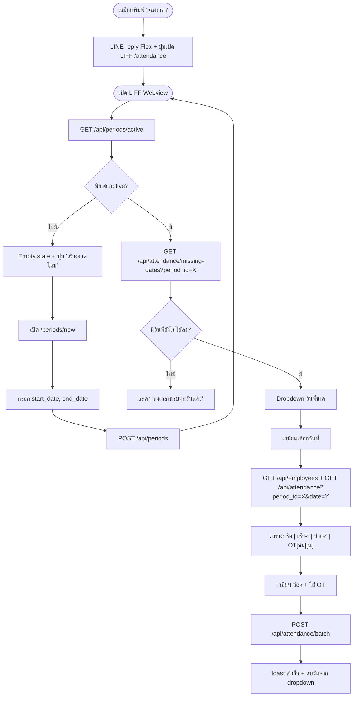
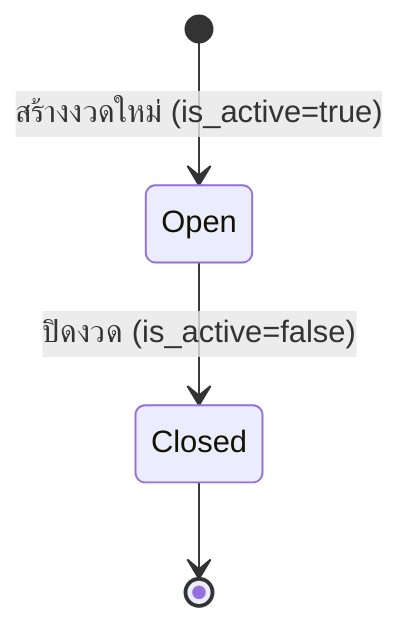

# JASS Payroll LINE OA — Product Requirements Document

**Version:** 1.1  
**Date:** 2026-04-28  
**Owner:** Angela (Full Stack Developer)  
**Status:** Phase 1 in progress

---

## 1. Overview

ระบบลงเวลางานและคำนวณเงินเดือนผ่าน LINE Official Account (LINE OA) สำหรับบริษัทขนาดเล็ก-กลาง ที่ต้องการ Track การเข้างาน บันทึกรายละเอียดงาน และคำนวณเงินเดือนได้ภายใน LINE โดยไม่ต้องติดตั้ง App เพิ่มเติม ใช้งานผ่านทั้ง LINE Chat (webhook) และ LIFF (mini-app ใน LINE)

---

## 2. Problem Statement

บริษัทขนาดเล็กที่มีพนักงานรายวันหรือรายเดือน มักบันทึกเวลาและคำนวณเงินเดือนด้วย Excel หรือกระดาษ ทำให้เกิด:

- ข้อมูลหาย / คำนวณผิด เมื่อต้องทำเองทุกงวด
- ไม่มีระบบ Audit trail — ไม่รู้ว่าแก้ข้อมูลเมื่อไหร่
- เสียเวลาสรุปยอดช่วงสิ้นงวด
- ผู้บริหารไม่มีมุมมองภาพรวมแบบ Real-time

---

## 3. Goals & Success Metrics

| Goal | Metric | Target |
|------|--------|--------|
| ลดเวลาสรุปเงินเดือนต่องวด | เวลาที่ใช้ทำ Payroll | จาก ~2 ชั่วโมง → < 15 นาที |
| Zero data-entry errors | ความถูกต้องของยอดสุทธิ | 100% match กับการคำนวณ manual |
| Adoption by clerk | การใช้งานจริง | Clerk บันทึกเวลาผ่าน LINE ≥ 90% ของวันทำงาน |

---

## 4. Scope

### In Scope (v1)

- **จัดการพนักงาน:** เพิ่ม / แก้ไข / ลบ + กำหนดอัตราค่าจ้างรายวัน
- **ลงเวลางาน:** บันทึกเช้า/บ่าย + OT รายคนต่อวัน โดยเสมียน
- **งวดเงินเดือน:** สร้างงวด (start/end date), ปิดงวดด้วย is_active = false
- **คำนวณเงินเดือน:** gross = วันทำงาน × wage + OT × ot_rate
- **รายงาน:** สรุปเวลาและยอดเงินแยกตามพนักงานและงวด
- **Platform:** LINE OA (Flex Message + Webhook) + LIFF (Web UI)

### Out of Scope (v2+)

- Self check-in โดยพนักงานเอง
- Multi-organization (SaaS mode)
- Payslip PDF export
- Leave management
- Integration กับ Accounting ภายนอก

---

## 5. User Stories & Requirements

### 5.1 Feature: จัดการพนักงาน ✅ Done



### 5.2 Feature: ลงเวลางาน ✅ Done



### 5.3 Feature: จัดการงวดเงินเดือน 🔲 Phase 2

- สร้างงวดใหม่ — `POST /api/periods` (done)
- ปิดงวดเมื่อสรุปเสร็จ — `PATCH /api/periods/:id` set `is_active = false`
- ดูรายการงวดทั้งหมด — `GET /api/periods`

**State:**



### 5.4 Feature: คำนวณเงินเดือน 🔲 Phase 2

**สูตรคำนวณ:**

```
gross = (จำนวนวันที่ morning_check หรือ afternoon_check = true × wage)
      + (sum(ot) × ot_rate)

วันทำงาน = นับแถว attendance ที่ morning_check = true OR afternoon_check = true
```

**LINE handler:** `>คำนวณ` → เลือกงวด → reply Flex สรุปยอดรายคน

### 5.5 Feature: รายงาน 🔲 Phase 3

- สรุปการเข้างานรายพนักงาน แยกตามงวด
- ยอดเงินเดือนภาพรวมทั้งงวด
- LINE handler: `>รายงาน`

---

## 6. Technical Constraints

- ต้องใช้ **LINE OA Webhook** เป็น entry point หลัก
- LIFF URL ต้องเป็น HTTPS (ngrok ช่วง dev)
- Backend ต้องรัน verify signature ของ LINE ทุก request
- Database: **Supabase (PostgreSQL)**
- Stack: Node.js + Express + TypeScript (backend), React + Vite + Tailwind + LIFF (frontend)
- Timezone: `Asia/Bangkok (UTC+7)`

---

## 7. Open Questions

- [ ] ระบบรองรับหลาย LINE User เป็นเสมียนได้ไหม? (line_users table อยู่ใน Phase 3)
- [ ] OT threshold กี่ชั่วโมง? ปัจจุบัน OT = input โดยตรง ไม่มี threshold
- [ ] งวดเงินเดือนมีกี่รูปแบบ? (ปัจจุบัน custom date range)
- [ ] ต้องการ Payslip PDF ไหม?

---

## 8. Timeline

| Phase | Description | Status |
|-------|-------------|--------|
| Phase 0 — Foundation | DB Schema, Supabase setup, scaffold | ✅ Done |
| Phase 1 — MVP Core | Employee CRUD + Attendance logging via LIFF | 🔄 In Progress |
| Phase 2 — Payroll | Period lock + calculation engine + report | 🔲 Next |
| Phase 3 — Polish | Tasks feature, report, LINE auth, error UX | 🔲 Planned |
| Phase 4 — Deploy | Production deploy, LINE OA config, UAT | 🔲 Planned |
