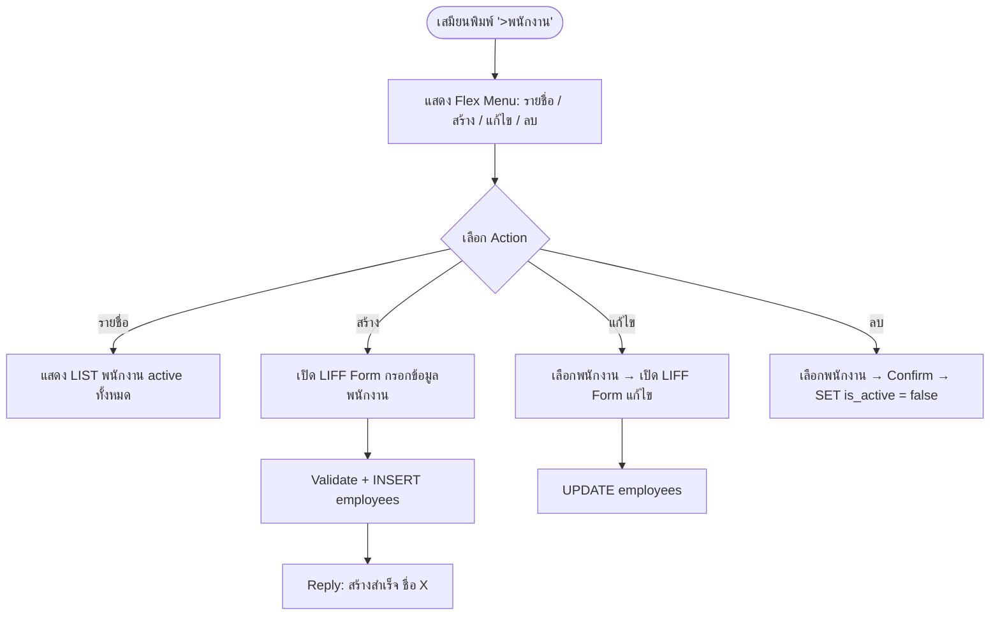
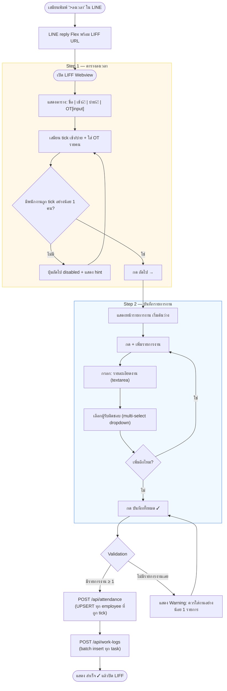
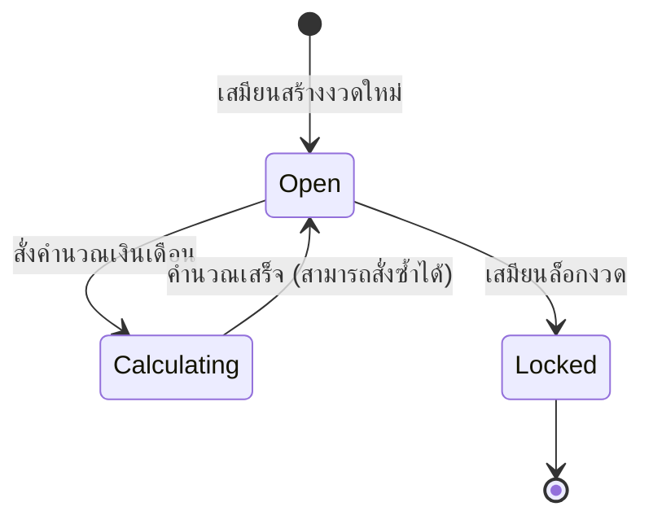

# JASS Payroll LINE OA — Product Requirements Document

**Version:** 1.0  
**Date:** 2026-04-27  
**Owner:** Angela (Full Stack Developer)  
**Status:** Draft

---

## 1. Overview

ระบบลงเวลางานและคำนวณเงินเดือนผ่าน LINE Official Account (LINE OA) สำหรับบริษัทขนาดเล็ก-กลาง ที่ต้องการ Track การเข้างาน บันทึกรายละเอียดงาน และคำนวณเงินเดือนได้ภายใน LINE โดยไม่ต้องติดตั้ง App เพิ่มเติม ใช้งานผ่านทั้ง LINE Chat (webhook) และ LIFF (mini-app ใน LINE)

---

## 2. Problem Statement

บริษัทขนาดเล็กที่มีพนักงานรายวันหรือรายเดือน มักบันทึกเวลาและคำนวณเงินเดือนด้วย Excel หรือกระดาษ ทำให้เกิด:

- ข้อมูลหาย / คำนวณผิด เมื่อต้องทำเองทุกงวด
- ไม่มีระบบ Audit trail — ไม่รู้ว่าแก้ข้อมูลเมื่อไหร่
- เสียเวลาสรุปยอดช่วงสิ้นงวด
- ผู้บริหารไม่มีมุมมองภาพรวมแบบ Real-time

ระบบนี้แก้ปัญหาผ่าน LINE ที่ทุกคนในทีมมีอยู่แล้ว ไม่ต้องเรียนรู้ tool ใหม่

---

## 3. Goals & Success Metrics

| Goal | Metric | Target |
|------|--------|--------|
| ลดเวลาสรุปเงินเดือนต่องวด | เวลาที่ใช้ทำ Payroll | จาก ~2 ชั่วโมง → < 15 นาที |
| Zero data-entry errors | ความถูกต้องของยอดสุทธิ | 100% match กับการคำนวณ manual |
| Adoption by clerk | การใช้งานจริง | Clerk บันทึกเวลาผ่าน LINE ≥ 90% ของวันทำงาน |
| Admin visibility | ความถี่ที่ Admin เปิดรายงาน | ≥ 1 ครั้ง/สัปดาห์ |

---

## 4. Scope

### In Scope (v1)

- **จัดการพนักงาน:** เพิ่ม / แก้ไข / ลบ + กำหนดอัตราค่าจ้าง (รายวัน, รายเดือน, OT/ชั่วโมง)
- **ลงเวลางาน:** บันทึกเวลาเข้า-ออกงานรายวัน (โดยเสมียน)
- **บันทึกรายละเอียดงาน:** ข้อความบรรยายงานที่ทำในแต่ละวัน
- **งวดเงินเดือน:** กำหนดช่วงวัน, ล็อก/ปิดงวด
- **คำนวณเงินเดือน:** ประมวลผลจากวันทำงาน + OT → ยอดสุทธิต่อคน
- **รายงาน:** ดูสรุปเวลา, งาน, และยอดเงินแยกตามพนักงานและงวด
- **2 บทบาท:** เสมียน (Full CRUD) + เจ้านาย (Read-only)
- **Platform:** LINE OA (Flex Message + Webhook) + LIFF (Web UI สำหรับ form ที่ซับซ้อน)

### Out of Scope (future / v2+)

- Self check-in โดยพนักงานเอง (ผ่าน GPS หรือ QR Code)
- Multi-organization (SaaS mode)
- Mobile App นอก LINE
- Integration กับระบบ Accounting ภายนอก (QuickBooks, etc.)
- Leave / วันลา management
- Payslip PDF export (อาจเพิ่มใน v1.5)

---

## 5. User Stories & Requirements

### 5.1 Feature: จัดการพนักงาน

- As a เสมียน, I want to เพิ่มพนักงานใหม่ so that ระบบรู้จักพนักงานก่อนบันทึกเวลา
- As a เสมียน, I want to แก้ไขอัตราค่าจ้าง so that ยอดเงินเดือนคำนวณถูกต้องตามอัตราปัจจุบัน
- As a เสมียน, I want to ดูรายชื่อพนักงานทั้งหมด so that ไม่บันทึกเวลาให้คนที่ไม่ได้ทำงานแล้ว
- As a เสมียน, I want to ลบ (deactivate) พนักงาน so that ข้อมูลเก่ายังอยู่ แต่ไม่ขึ้นมาใน active list

**User Flow:**



### 5.2 Feature: ลงเวลางานและบันทึกงาน (Webview 2 ขั้นตอน)

- As a เสมียน, I want to เห็นพนักงานทุกคนในตารางและ tick เช้า/บ่ายทีเดียว so that บันทึกเวลาได้เร็วโดยไม่ต้องทำทีละคน
- As a เสมียน, I want to ใส่ OT แยกรายคน so that คำนวณค่าล่วงเวลาถูกต้อง
- As a เสมียน, I want to บันทึกงานที่ทำวันนั้น + ระบุว่าใครรับผิดชอบ so that เจ้านายตามงานได้
- As a เสมียน, I want to เพิ่มได้หลายรายการงานต่อวัน so that ครอบคลุมงานหลายอย่างในวันเดียว
- As a เสมียน, I want to แก้ไขข้อมูลย้อนหลัง so that แก้ได้เมื่อลืมบันทึก

---

#### UI Flow — Step 1: ตารางลงเวลา

เสมียนเปิด LIFF เห็นตารางพนักงาน active ทั้งหมด — 1 แถวต่อ 1 คน

| ชื่อพนักงาน | เช้า ☐ | บ่าย ☐ | OT (ชม.) |
|-------------|--------|--------|----------|
| สมชาย | ☐ | ☐ | `[___]` |
| สมหญิง | ☐ | ☐ | `[___]` |
| ... | | | |

- **เช้า / บ่าย** = checkbox (มาทำงาน shift นั้นหรือเปล่า)
- **OT** = number input, default 0, step 0.5 (ชั่วโมง)
- ด้านบนแสดง **วันที่** ปัจจุบัน (แก้ได้ถ้าต้องการบันทึกย้อนหลัง)
- ปุ่ม **"ถัดไป →"** ด้านล่าง (disabled ถ้าไม่มีใครถูก tick เลย)

> **ตรรกะ hours_worked:**
> - เช้า = 4 ชั่วโมง, บ่าย = 4 ชั่วโมง
> - `hours_worked = (เช้า ? 4 : 0) + (บ่าย ? 4 : 0) + ot_hours`

---

#### UI Flow — Step 2: รายการงานที่ทำวันนั้น

หน้านี้บันทึก **task-level work log** — 1 รายการงาน มีผู้รับผิดชอบได้หลายคน

แต่ละรายการงาน:
- **รายละเอียดงาน** (textarea): บรรยายสิ่งที่ทำ เช่น "ขุดรากต้นไม้บริเวณ A"
- **ผู้รับผิดชอบ** (multi-select dropdown): เลือกได้หลายคนจากรายชื่อพนักงาน active

ปุ่ม **"+ เพิ่มรายการงาน"** — กดได้ไม่จำกัดรอบ

ปุ่ม **"บันทึกทั้งหมด ✓"** — submit ทั้ง attendance + work_logs พร้อมกัน

---

**User Flow (Mermaid):**



### 5.3 Feature: จัดการงวดเงินเดือน

- As a เสมียน, I want to สร้างงวดใหม่ระบุช่วงวัน so that รู้ว่า payroll นี้คำนวณช่วงไหน
- As a เสมียน, I want to ล็อกงวดเมื่อสรุปเสร็จ so that ไม่มีการแก้ไขข้อมูลย้อนหลังอีก

**State Diagram:**



### 5.4 Feature: คำนวณเงินเดือน

- As a เสมียน, I want to สั่งคำนวณเงินเดือนสำหรับงวดที่เลือก so that ได้ยอดสุทธิรายคนทันที
- As a เสมียน, I want to ดูรายละเอียดการคำนวณแต่ละคน so that ตรวจสอบว่าถูกต้องก่อนจ่าย

**สูตรคำนวณ:**

```
สำหรับพนักงานรายวัน:
  gross = (จำนวนวันทำงาน × rate_daily) + (ชั่วโมง OT × rate_ot_per_hour)

สำหรับพนักงานรายเดือน:
  gross = rate_monthly + (ชั่วโมง OT × rate_ot_per_hour)
```

### 5.5 Feature: ดูรายงาน (Admin + เสมียน)

- As a เจ้านาย, I want to ดูสรุปการเข้างานรายพนักงาน so that รู้ว่าใครขาด/มาสาย
- As a เจ้านาย, I want to ดูยอดเงินเดือนภาพรวมทั้งงวด so that วางแผนเงินสดได้
- As a เสมียน, I want to export รายงานเป็น text summary so that ส่งให้เจ้านาย approve ได้ง่าย

---

## 6. Technical Constraints

- ต้องใช้ **LINE OA Webhook** เป็น entry point หลัก
- LIFF URL ต้องเป็น HTTPS (ใช้ ngrok ช่วง dev)
- Backend ต้องรัน verify signature ของ LINE ทุก request
- Database: **Supabase (PostgreSQL)** ใช้ Supabase client ผ่าน service role
- Stack ที่กำหนดแล้ว: Node.js + Express + TypeScript (backend), React + Vite + Tailwind + LIFF (frontend)
- Monorepo: npm workspaces (`apps/backend`, `apps/web`)
- Timezone: `Asia/Bangkok (UTC+7)` ทุก timestamp

---

## 7. Open Questions

- [ ] ระบบรองรับหลาย LINE User เป็นเสมียนได้ไหม? หรือ 1 account เท่านั้น?
- [ ] พนักงานมี LINE Account ด้วยไหม? หรือเสมียนบันทึกให้ทั้งหมด?
- [ ] OT คิดจาก threshold กี่ชั่วโมง? (เช่น >8 ชั่วโมง = OT)
- [ ] งวดเงินเดือนมีกี่รูปแบบ? (รายปักษ์ / รายเดือน / custom?)
- [ ] ต้องการ Payslip PDF ใน v1 ไหม หรือ v1.5?
- [ ] Role ของ LINE user กำหนดจากไหน? (hardcode LINE userId? หรือ config ใน DB?)

---

## 8. Timeline (rough)

| Phase | Description | Target |
|-------|-------------|--------|
| Phase 0 — Foundation | DB Schema, Supabase setup, LINE Auth middleware, LIFF scaffold | สัปดาห์ที่ 1–2 |
| Phase 1 — MVP Core | Employee CRUD + Attendance logging via LIFF | สัปดาห์ที่ 3–4 |
| Phase 2 — Payroll | Payroll period + calculation engine + basic report | สัปดาห์ที่ 5–6 |
| Phase 3 — Polish | Work log, advanced report, Admin view, error handling | สัปดาห์ที่ 7–8 |
| Phase 4 — Deploy | Production deploy, LINE OA config, UAT | สัปดาห์ที่ 9 |
