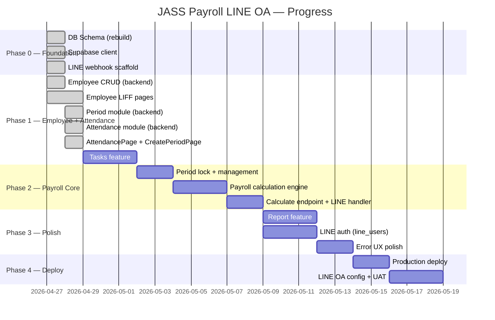

# JASS Payroll LINE OA — Project Roadmap

**Updated:** 2026-04-28  
**Current Phase:** Phase 1 (in progress)

---

## Roadmap Overview

| Phase | Scope | Status |
|-------|-------|--------|
| Phase 0 — Foundation | DB Schema, Supabase setup, LINE webhook scaffold | ✅ Done |
| Phase 1 — Employee + Attendance MVP | Employee CRUD via LIFF + Attendance logging + Period management | 🔄 In Progress |
| Phase 2 — Payroll Core | Payroll calculation engine + period lock + summary report | 🔲 Next |
| Phase 3 — Polish & Report | Tasks feature, advanced report, LINE auth, error UX | 🔲 Planned |
| Phase 4 — Deploy & UAT | Production deploy, LINE OA config, UAT | 🔲 Planned |

---

## Progress Gantt



---

## Phase Details

### Phase 0 — Foundation ✅

- [x] DB migration `0002_rebuild_schema.sql`
- [x] Supabase client singleton
- [x] LINE webhook + signature verification (logic)
- [x] React + Vite + Tailwind scaffold

---

### Phase 1 — Employee + Attendance MVP 🔄

**Employee (done):**
- [x] Repository, Service, Controller, Routes
- [x] LINE handler `>พนักงาน`, `>รายชื่อ`
- [x] LIFF: Add, EditSelect, Edit pages

**Period (done):**
- [x] Repository, Service, Controller, Routes
- [x] `GET /api/periods/active`, `POST /api/periods`

**Attendance (done):**
- [x] Repository (missing-dates, byPeriodDate, upsertBatch)
- [x] Service, Controller, Routes
- [x] LINE handler `>ลงเวลา`
- [x] LIFF: AttendancePage + CreatePeriodPage

**Tasks (remaining):**
- [ ] Tasks backend (API)
- [ ] LIFF: บันทึกรายการงานต่อวัน

---

### Phase 2 — Payroll Core 🔲

**Period management (เพิ่มเติม):**
- `GET /api/periods` — รายการงวด
- `PATCH /api/periods/:id` — close งวด (is_active = false)

**Payroll engine:**
```
gross = วันทำงาน × wage + sum(ot) × ot_rate
วันทำงาน = count(attendance WHERE morning_check OR afternoon_check = true)
```

**LINE handler:**
- `>คำนวณ` → เลือกงวด → คำนวณ → reply Flex สรุปยอดรายคน

---

### Phase 3 — Polish & Report 🔲

- Wire LINE signature verification เป็น middleware จริง
- `line_users` table + role guard
- Report endpoints + `>รายงาน` handler
- Error UX: reply ภาษาไทยที่เข้าใจง่าย + help message

---

### Phase 4 — Deploy & UAT 🔲

- Railway (backend) + Vercel (frontend)
- ตั้ง LIFF URL + Webhook URL บน LINE Developers Console
- UAT กับ user จริง
