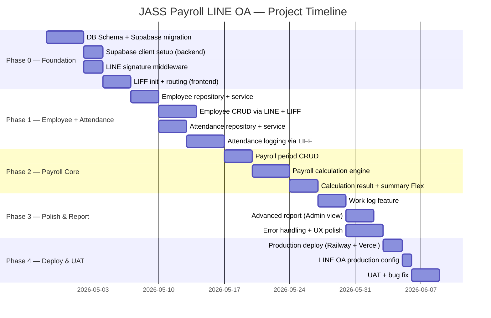

# JASS Payroll LINE OA — Project Roadmap

**Updated:** 2026-04-27  
**Target Launch:** ~9 สัปดาห์จากเริ่มต้น

---

## Roadmap Overview

| Phase | Scope | Effort | Depends On | Target |
|-------|-------|--------|------------|--------|
| Phase 0 — Foundation | DB Schema, Supabase setup, LINE auth middleware, LIFF init | M | — | สัปดาห์ 1–2 |
| Phase 1 — Employee + Attendance MVP | Employee CRUD via LIFF + Attendance logging | L | Phase 0 | สัปดาห์ 3–4 |
| Phase 2 — Payroll Core | Payroll period + calculation engine + summary report | L | Phase 1 | สัปดาห์ 5–6 |
| Phase 3 — Polish & Report | Work log, advanced report, Admin view, error UX | M | Phase 2 | สัปดาห์ 7–8 |
| Phase 4 — Deploy & UAT | Production deploy, LINE OA setup, UAT, bug fix | S | Phase 3 | สัปดาห์ 9 |

---

## Gantt Chart



---

## Phase Details

### Phase 0 — Foundation
**MVP ที่ต้องการ:** infrastructure พร้อม ก่อนเขียน feature จริง

- เขียน SQL migration สร้างทุก table (ตาม TECH_SPEC.md)
- ตั้งค่า Supabase client singleton ใน backend
- Implement `verifyLineSignature` middleware จริง (ปัจจุบัน file มีแล้ว แต่ยังไม่ได้ wire)
- LIFF `init()` ใน React app พร้อม error handling
- ตั้ง seed data: line_users 1 clerk + 1 admin สำหรับ test

**Blockers:**
- ต้องมี Supabase project URL + keys
- ต้องมี LINE OA + LIFF app ตั้งค่าแล้ว

---

### Phase 1 — Employee + Attendance MVP
**MVP ที่ต้องการ:** เสมียนเพิ่ม/ดูพนักงานได้ + บันทึกเวลาได้

**Employee:**
- Repository: `getAll`, `getById`, `create`, `update`, `deactivate`
- Service: validation logic
- LINE handler: `>พนักงาน` → menu → รายชื่อ / สร้าง / แก้ไข / ลบ
- LIFF page: `/employees/create`, `/employees/:id/edit`

**Attendance:**
- Repository: `upsert`, `getByPeriod`, `getByEmployee`
- Service: validate check_in < check_out, ไม่ให้บันทึกในงวดที่ lock แล้ว
- LINE handler: `>ลงเวลา` → เลือกพนักงาน → เปิด LIFF
- LIFF page: `/attendance/log`

---

### Phase 2 — Payroll Core
**MVP ที่ต้องการ:** คำนวณเงินเดือนได้ครบถ้วนถูกต้อง

**Payroll Period:**
- CRUD สำหรับงวด: สร้าง, ดูรายการ, ล็อก
- Validate: ไม่ให้ lock งวดที่ยังไม่ได้ calculate

**Payroll Engine (pure function):**
```
calculatePayroll(employees[], attendance[], period) → payroll_results[]
```
- Loop พนักงาน → นับวันทำงาน + OT ในช่วง period
- คำนวณ gross ตาม wage_type (daily/monthly)
- บันทึก calculation_detail เป็น JSON (audit trail)

**Summary Flex Message:**
- แสดงรายชื่อ + ยอดสุทธิทุกคน
- รวมยอดทั้งหมดด้านล่าง

---

### Phase 3 — Polish & Report
**MVP ที่ต้องการ:** ระบบพร้อมใช้งานจริง

- Work log: บันทึกรายละเอียดงานรายวัน (LIFF form)
- Report: Admin ดูสรุปเวลา + ยอดเงินแยกรายคน/งวด
- Error UX: reply message ที่เข้าใจง่ายเมื่อ error
- Edge cases: บันทึกซ้ำ (UPSERT), งวดทับกัน (validate)

---

### Phase 4 — Deploy & UAT
- Deploy backend บน Railway (หรือ Render)
- Deploy frontend บน Vercel (static)
- ตั้ง LIFF URL production ใน LINE Developers Console
- ตั้ง Webhook URL production ใน LINE OA
- UAT กับ user จริง (เสมียน + เจ้านาย)
- Fix bugs จาก UAT
