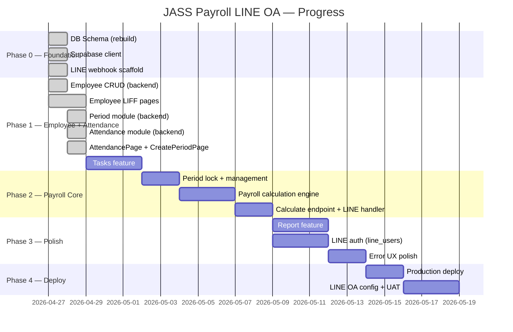

# JASS Payroll LINE OA — Project Roadmap

**Updated:** 2026-05-05  
**Current Phase:** Phase 2 (starting)

---

## Roadmap Overview

| Phase | Scope | Status |
|-------|-------|--------|
| Phase 0 — Foundation | DB Schema, Supabase setup, LINE webhook scaffold | ✅ Done |
| Phase 1 — Employee + Attendance MVP | Employee CRUD via LIFF + Attendance + Period + Tasks + PDF Report | ✅ Done |
| Phase 2 — Payroll Core | Payroll calculation engine + period lock | 🔄 In Progress |
| Phase 3 — Polish | LINE auth, error UX | 🔲 Planned |
| Phase 4 — Deploy & UAT | Production deploy, LINE OA config, UAT | 🔲 Planned |

---

## Progress Gantt


```mermaid
gantt
    title JASS Payroll LINE OA — Progress
    dateFormat  YYYY-MM-DD
    section Phase 0 — Foundation
    DB Schema (rebuild)                   :done, p0a, 2026-04-27, 1d
    Supabase client                       :done, p0b, 2026-04-27, 1d
    LINE webhook scaffold                 :done, p0c, 2026-04-27, 1d

    section Phase 1 — Employee + Attendance
    Employee CRUD (backend)               :done, p1a, 2026-04-27, 1d
    Employee LIFF pages                   :done, p1b, 2026-04-27, 2d
    Period module (backend)               :done, p1c, 2026-04-28, 1d
    Attendance module (backend)           :done, p1d, 2026-04-28, 1d
    AttendancePage + CreatePeriodPage     :done, p1e, 2026-04-28, 1d
    Tasks feature                         :p1f, after p1e, 3d

    section Phase 2 — Payroll Core
    Period lock + management              :p2a, after p1f, 2d
    Payroll calculation engine            :p2b, after p2a, 3d
    Calculate endpoint + LINE handler     :p2c, after p2b, 2d

    section Phase 3 — Polish
    Report feature                        :p3a, after p2c, 3d
    LINE auth (line_users)                :p3b, after p2c, 3d
    Error UX polish                       :p3c, after p3a, 2d

    section Phase 4 — Deploy
    Production deploy                     :p4a, after p3c, 2d
    LINE OA config + UAT                  :p4b, after p4a, 3d
```

---

## Phase Details

### Phase 0 — Foundation ✅

- [x] DB migration `0002_rebuild_schema.sql`
- [x] Supabase client singleton
- [x] LINE webhook + signature verification (logic)
- [x] React + Vite + Tailwind scaffold

---

### Phase 1 — Employee + Attendance MVP ✅

**Employee:**
- [x] Repository, Service, Controller, Routes
- [x] LINE handler `>พนักงาน`, `>รายชื่อ`
- [x] LIFF: Add, EditSelect, Edit pages

**Period:**
- [x] Repository, Service, Controller, Routes
- [x] `GET /api/periods/active`, `POST /api/periods`

**Attendance:**
- [x] Repository (missing-dates, byPeriodDate, upsertBatch)
- [x] Service, Controller, Routes
- [x] LINE handler `>ลงเวลา`
- [x] LIFF: AttendancePage (calendar view) + CreatePeriodPage

**Tasks:**
- [x] Repository, Service, Controller, Routes
- [x] `GET /api/tasks?date=`, `POST /api/tasks`, `PUT /api/tasks`, `POST /api/tasks/summary`
- [x] `POST /api/tasks/images` — upload รูปไป Supabase Storage
- [x] Task model มี `start_time`, `end_time`, `images[]`
- [x] LIFF: CreateTasksPage — batch entry + image upload
- [x] LINE: Daily Summary Broadcast หลัง save

**Reports (implement เร็วกว่า schedule):**
- [x] `GET /api/reports/work?date=` — PDF 3 หน้า (attendance, OT, tasks)
- [x] `GET /api/reports/work/current` — PDF งวดปัจจุบัน
- [x] `GET /api/reports/daily?date=` — daily PDF
- [x] LIFF: WorkReportPage (`/report/work`)

---

### Phase 2 — Payroll Core 🔄

**Period management:**
- `PATCH /api/periods/:id` — close งวด (is_active = false)

**Payroll engine:**
```
gross = วันทำงาน × wage + sum(ot) × ot_rate
วันทำงาน = count(attendance WHERE morning_check OR afternoon_check = true)
```

**Endpoints:**
- `POST /api/periods/:id/calculate` — คำนวณ + cache ผล
- `GET /api/periods/:id/results` — ดูผลคำนวณ

**LINE handler:**
- `>คำนวณ` → เลือกงวด → คำนวณ → reply Flex สรุปยอดรายคน

---

### Phase 3 — Polish 🔲

- Wire LINE signature verification เป็น middleware จริง
- `line_users` table + role guard
- Error UX: reply ภาษาไทยที่เข้าใจง่าย + help message

---

### Phase 4 — Deploy & UAT 🔲

- Railway (backend) + Vercel (frontend)
- ตั้ง LIFF URL + Webhook URL บน LINE Developers Console
- UAT กับ user จริง
