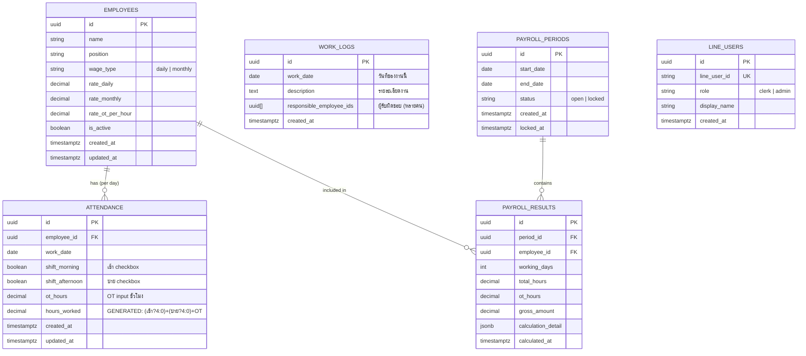
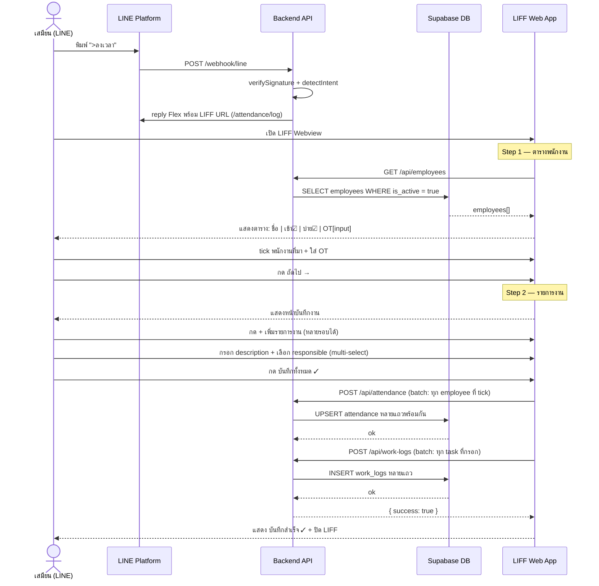
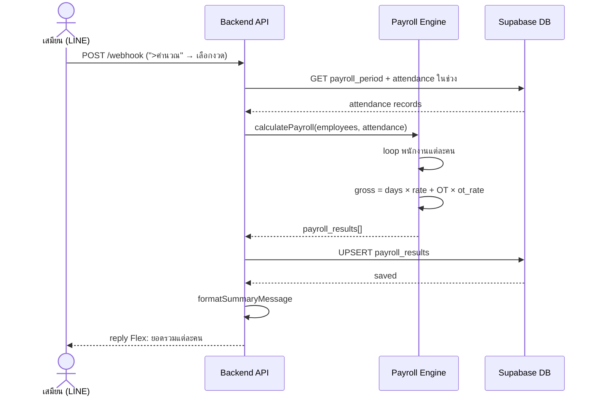
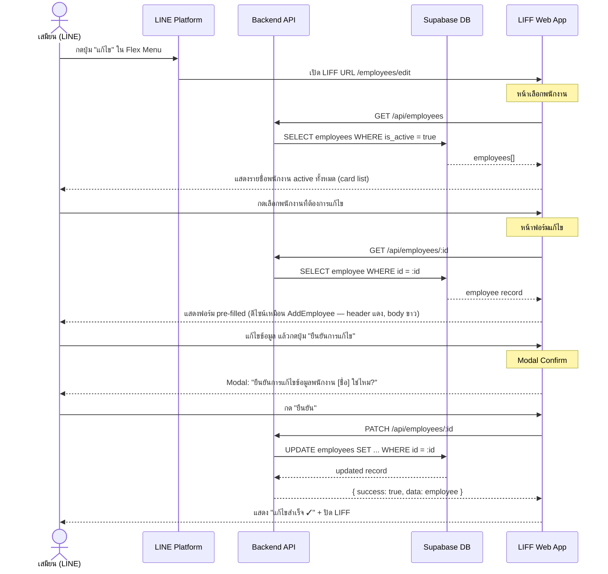

# JASS Payroll LINE OA — Technical Specification

**Version:** 1.0  
**Date:** 2026-04-27  
**Author:** Angela  
**Related PRD:** PRD.md

---

## 1. Summary

Spec นี้ครอบคลุม architecture, data model, API design, และ LINE integration flow ของระบบ jass-payroll-lineoa — ระบบลงเวลาและคำนวณเงินเดือนผ่าน LINE OA สำหรับ single organization

---

## 2. Background & Context

ปัจจุบัน project อยู่ใน scaffold phase:
- Backend: Express + TypeScript พร้อม webhook route `/webhook/line`
- Frontend: React + Vite + LIFF พร้อม basic layout
- DB: Supabase project ตั้งค่าแล้ว แต่ schema ยังไม่มี
- LINE: webhook รับ event ได้ แต่ handle แค่ `>พนักงาน` trigger

สิ่งที่ต้องสร้างทั้งหมด: DB schema, service layer, LIFF forms, payroll engine

---

## 3. Goals

- กำหนด schema ที่ support ทุก feature ใน v1 โดยไม่ต้อง migrate ใหญ่ทีหลัง
- ออกแบบ LINE message flow ให้ใช้งานง่ายโดยไม่ต้องพิมพ์คำสั่งยาวๆ
- แยก business logic ออกจาก LINE handler ให้ testable
- รองรับ LIFF สำหรับ form ที่ซับซ้อน (form input ที่ LINE chat ทำไม่ได้)

---

## 4. Non-Goals

- ไม่ทำ multi-tenant ใน v1 (1 LINE OA = 1 organization)
- ไม่ทำ real-time push notification (ไม่ใช่ push message ตามกำหนดเวลา)
- ไม่ทำ PDF export ใน v1
- ไม่ทำ unit test framework setup ใน phase 0 (เพิ่มทีหลัง)

---

## 5. System Design

### 5.1 Architecture Overview

```
LINE App (User)
    │
    │ (1) ส่งข้อความ / กดปุ่ม Flex
    ▼
LINE Platform
    │
    │ (2) POST /webhook/line (signed)
    ▼
Backend (Express + TypeScript)
    ├── Middleware: verifyLineSignature
    ├── Router: lineWebhookRouter
    ├── Handler: handleLineEvent
    │       ├── Intent Detection (text matching)
    │       └── dispatch → Service Layer
    │
    ├── Service Layer (pure business logic)
    │       ├── EmployeeService
    │       ├── AttendanceService
    │       ├── PayrollService
    │       └── ReportService
    │
    └── Repository Layer (Supabase client)
            ├── employeeRepository
            ├── attendanceRepository
            ├── payrollRepository
            └── workLogRepository

LIFF (React + Vite)
    │
    │ (3) User กด LIFF URL ใน LINE
    ▼
Web App (React)
    ├── liff.init() → get userId, displayName
    ├── Form pages (Employee CRUD, Attendance, etc.)
    └── POST /api/* → Backend REST API
```

### 5.2 Components

| Component | Responsibility | Tech |
|-----------|---------------|------|
| LINE Webhook Handler | รับ event จาก LINE, route ตาม intent | Express Route + TypeScript |
| Intent Detector | แปลง text/postback → action | Pattern matching (ไม่ใช้ AI) |
| Service Layer | Business logic, validation, orchestration | TypeScript classes/functions |
| Repository Layer | CRUD operations กับ Supabase | Supabase JS client |
| Payroll Engine | คำนวณเงินเดือนจาก attendance + rates | Pure TypeScript function |
| LIFF Web App | Form UI สำหรับ input ที่ซับซ้อน | React + Tailwind |
| LINE Flex Builder | สร้าง Flex Message JSON | TypeScript factory functions |

### 5.3 Data Model



### 5.4 SQL Schema (Supabase Migration)

```sql
-- employees
CREATE TABLE employees (
  id uuid PRIMARY KEY DEFAULT gen_random_uuid(),
  name text NOT NULL,
  position text,
  wage_type text NOT NULL CHECK (wage_type IN ('daily', 'monthly')),
  rate_daily numeric(10,2) DEFAULT 0,
  rate_monthly numeric(10,2) DEFAULT 0,
  rate_ot_per_hour numeric(10,2) DEFAULT 0,
  is_active boolean DEFAULT true,
  created_at timestamptz DEFAULT now(),
  updated_at timestamptz DEFAULT now()
);

-- attendance (shift-based — เช้า/บ่าย checkbox แทน check_in/check_out)
CREATE TABLE attendance (
  id uuid PRIMARY KEY DEFAULT gen_random_uuid(),
  employee_id uuid REFERENCES employees(id) ON DELETE CASCADE,
  work_date date NOT NULL,
  shift_morning boolean NOT NULL DEFAULT false,   -- เช้า checkbox
  shift_afternoon boolean NOT NULL DEFAULT false, -- บ่าย checkbox
  ot_hours numeric(4,1) NOT NULL DEFAULT 0,       -- OT input (ทศนิยม 0.5 ได้)
  hours_worked numeric(5,1) GENERATED ALWAYS AS (
    (CASE WHEN shift_morning   THEN 4.0 ELSE 0.0 END) +
    (CASE WHEN shift_afternoon THEN 4.0 ELSE 0.0 END) +
    ot_hours
  ) STORED,
  created_at timestamptz DEFAULT now(),
  updated_at timestamptz DEFAULT now(),
  UNIQUE(employee_id, work_date)
);

-- work_logs (task-level — 1 งาน มีผู้รับผิดชอบได้หลายคน)
-- responsible_employee_ids = uuid[] ไม่ผูก FK constraint เพื่อ flexibility
-- ตอน query ใช้ WHERE id = ANY(responsible_employee_ids)
CREATE TABLE work_logs (
  id uuid PRIMARY KEY DEFAULT gen_random_uuid(),
  work_date date NOT NULL,
  description text NOT NULL,
  responsible_employee_ids uuid[] NOT NULL DEFAULT '{}',
  created_at timestamptz DEFAULT now()
);
-- index สำหรับ query "งานของพนักงาน X"
CREATE INDEX idx_work_logs_responsible ON work_logs USING GIN (responsible_employee_ids);

-- payroll_periods
CREATE TABLE payroll_periods (
  id uuid PRIMARY KEY DEFAULT gen_random_uuid(),
  start_date date NOT NULL,
  end_date date NOT NULL,
  status text NOT NULL DEFAULT 'open' CHECK (status IN ('open', 'locked')),
  created_at timestamptz DEFAULT now(),
  locked_at timestamptz
);

-- payroll_results
CREATE TABLE payroll_results (
  id uuid PRIMARY KEY DEFAULT gen_random_uuid(),
  period_id uuid REFERENCES payroll_periods(id),
  employee_id uuid REFERENCES employees(id),
  working_days int DEFAULT 0,
  total_hours numeric(6,2) DEFAULT 0,
  ot_hours numeric(5,2) DEFAULT 0,
  gross_amount numeric(12,2) DEFAULT 0,
  calculation_detail jsonb,
  calculated_at timestamptz DEFAULT now(),
  UNIQUE(period_id, employee_id)
);

-- line_users (role management)
CREATE TABLE line_users (
  id uuid PRIMARY KEY DEFAULT gen_random_uuid(),
  line_user_id text UNIQUE NOT NULL,
  role text NOT NULL DEFAULT 'clerk' CHECK (role IN ('clerk', 'admin')),
  display_name text,
  created_at timestamptz DEFAULT now()
);
```

### 5.5 API Endpoints

#### REST (ใช้กับ LIFF)

| Method | Path | Description | Role |
|--------|------|-------------|------|
| GET | /api/employees | รายชื่อพนักงาน active | clerk, admin |
| POST | /api/employees | สร้างพนักงานใหม่ | clerk |
| PATCH | /api/employees/:id | แก้ไขข้อมูลพนักงาน | clerk |
| DELETE | /api/employees/:id | deactivate พนักงาน | clerk |
| POST | /api/attendance | บันทึก/แก้ไขเวลาทำงาน | clerk |
| GET | /api/attendance?employeeId=&periodId= | ดูเวลาทำงาน | clerk, admin |
| POST | /api/work-logs | บันทึกรายละเอียดงาน | clerk |
| GET | /api/payroll-periods | รายการงวดทั้งหมด | clerk, admin |
| POST | /api/payroll-periods | สร้างงวดใหม่ | clerk |
| POST | /api/payroll-periods/:id/calculate | สั่งคำนวณเงินเดือน | clerk |
| PATCH | /api/payroll-periods/:id/lock | ล็อกงวด | clerk |
| GET | /api/payroll-periods/:id/results | ดูผลคำนวณ | clerk, admin |
| GET | /health | Health check | public |
| POST | /webhook/line | LINE webhook | LINE Platform |

#### Error Format (Standard)

```json
{
  "success": false,
  "error": "human-readable message",
  "code": "EMPLOYEE_NOT_FOUND"
}
```

#### Success Format

```json
{
  "success": true,
  "data": { ... }
}
```

---

## 6. LINE Message Flow

### 6.1 Sequence: ลงเวลางาน (2-Step Webview)



### 6.2 Sequence: คำนวณเงินเดือน



### 6.3 Sequence: แก้ไขพนักงาน (Edit Employee Flow)



### 6.4 Intent Trigger Map

| User พิมพ์ / กดปุ่ม | Intent | Action |
|----------------------|--------|--------|
| `>พนักงาน` | EMPLOYEE_MENU | แสดง Flex Menu: รายชื่อ/สร้าง/แก้ไข/ลบ |
| `>ลงเวลา` | ATTENDANCE_WEBVIEW | reply LIFF URL โดยตรง (ไม่ต้องเลือกพนักงานก่อน — ตารางอยู่ใน LIFF) |
| `>งวด` | PERIOD_MENU | แสดง Flex: สร้างงวด / รายการงวด |
| `>คำนวณ` | CALCULATE_MENU | แสดง Flex: เลือกงวดที่จะคำนวณ |
| `>รายงาน` | REPORT_MENU | แสดง Flex: เลือกประเภทรายงาน |
| Postback: `employee_list` | LIST_EMPLOYEES | ดึง list + reply text |
| Postback: `employee_create` | CREATE_EMPLOYEE | ส่ง LIFF URL `/employees/new` (form สร้าง) |
| Postback: `employee_edit` | EDIT_EMPLOYEE | ส่ง LIFF URL `/employees/edit` (หน้าเลือกพนักงาน) |
| Postback: `attendance_log:{id}` | LOG_ATTENDANCE | ส่ง LIFF URL (form บันทึกเวลา) |

> **หมายเหตุ:** ปุ่ม "แก้ไข" ใน Flex Message ต้องเป็น `uri` action (ไม่ใช่ `message`) ชี้ไปที่ `${liffBase}/employees/edit` เพื่อเปิด LIFF โดยตรง

---

## 7. Key Decisions & Tradeoffs

| Decision | Options Considered | Choice | Reason |
|----------|--------------------|--------|--------|
| DB | Firebase vs Supabase | Supabase | SQL > NoSQL สำหรับ payroll calculation, มี dashboard ดี |
| Frontend | Next.js vs React+Vite | React+Vite | lightweight, deploy บน static hosting ได้, LIFF ไม่ต้องการ SSR |
| ORM | Prisma vs Drizzle vs Supabase client | Supabase client โดยตรง | ลด dependency, Supabase JS client ครอบคลุมพอสำหรับ CRUD |
| Webhook Auth | ไม่ verify vs verify signature | Verify ทุก request | Security — LINE docs บังคับ |
| LINE Form | Chat-based form vs LIFF | LIFF สำหรับ complex form | Chat-based form ซับซ้อน / error-prone สำหรับ multi-field input |
| Role management | LINE Group role vs DB | DB (line_users table) | ยืดหยุ่นกว่า, เปลี่ยน role ได้โดยไม่เปลี่ยน LINE config |
| hours_worked | คำนวณใน app vs DB GENERATED | GENERATED ALWAYS (SQL) | ลด bug จาก manual calculation, เก็บแค่ check_in/out |

---

## 8. Security Considerations

- **LINE Signature Verification:** ทุก request ที่ `/webhook/line` ต้อง verify `x-line-signature` header ด้วย HMAC-SHA256 กับ `LINE_CHANNEL_SECRET` — ทำใน middleware ก่อนถึง handler
- **Role Guard:** API endpoints ที่ต้องการ auth จะ extract LINE userId จาก LIFF token แล้ว query `line_users` table เพื่อตรวจ role
- **Supabase Service Role:** Backend ใช้ `SUPABASE_SERVICE_ROLE_KEY` เท่านั้น (ไม่ expose anon key ฝั่ง backend)
- **LIFF Init:** Frontend ต้อง `liff.init()` สำเร็จก่อนถึงจะ call API ได้ — ป้องกัน non-LINE access
- **Input Validation:** ใช้ Zod validate ทุก request body ก่อนถึง service layer
- **Timezone:** บันทึกเป็น UTC ใน DB, แปลงเป็น Asia/Bangkok เฉพาะตอน display

---

## 9. Testing Plan

- **Unit tests (ในอนาคต):** Payroll Engine — test calculation logic กับ dataset ที่รู้คำตอบแน่นอน
- **Integration tests:** API endpoints หลัก (employee CRUD, attendance create/update, payroll calculate)
- **Manual QA checklist ก่อน deploy:**
  - [ ] สร้างพนักงานใหม่ผ่าน LIFF → ขึ้น list ใน LINE
  - [ ] บันทึกเวลาทำงาน → ข้อมูลถูกต้องใน Supabase
  - [ ] คำนวณเงินเดือน → ยอดตรงกับ manual Excel
  - [ ] ล็อกงวด → ไม่สามารถแก้ attendance ในช่วงนั้นได้
  - [ ] Admin เห็นแค่ read-only report (ไม่มีปุ่ม CRUD)

---

## 10. Open Questions / Risks

- [ ] OT threshold: เกิน 8 ชั่วโมง/วัน = OT หรือกำหนดต่างกันต่อพนักงาน?
- [ ] งวดเงินเดือนทับกันได้ไหม? (ถ้าไม่ควร add unique constraint)
- [ ] LINE LIFF URL routing: 1 LIFF app หลาย route หรือแยก LIFF หลาย app?
- [ ] ถ้า LINE signature verify fail → return 200 หรือ 400? (LINE แนะนำ return 200 เสมอ)
- [ ] Supabase Row Level Security (RLS): เปิด RLS ไหม? หรือใช้ service_role bypass ทั้งหมด?
