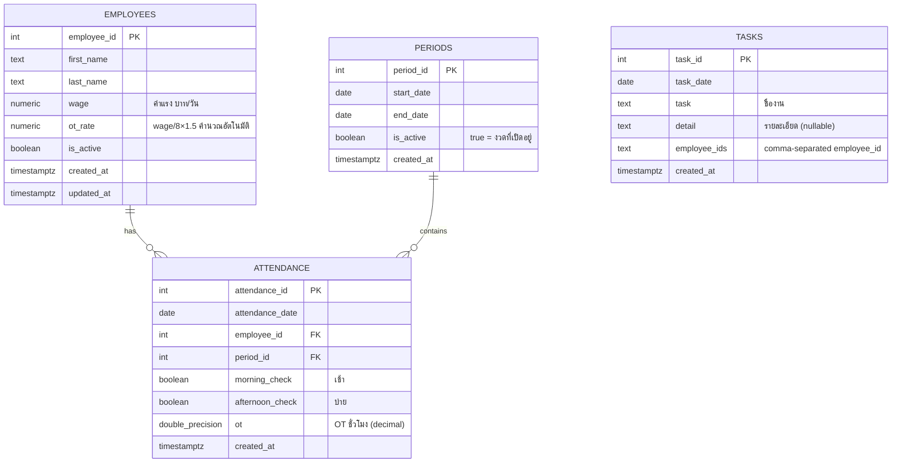
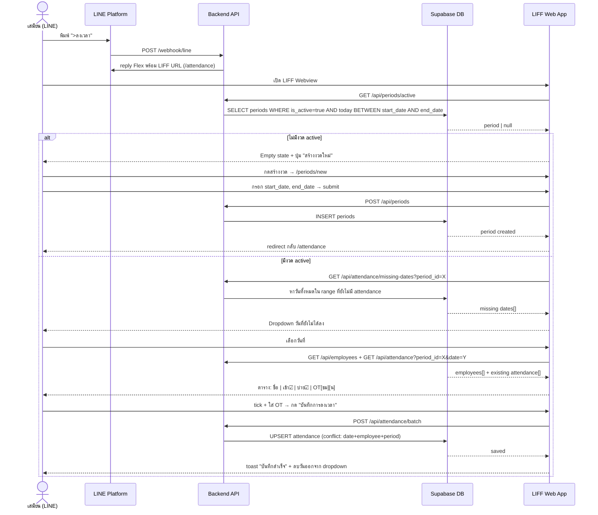
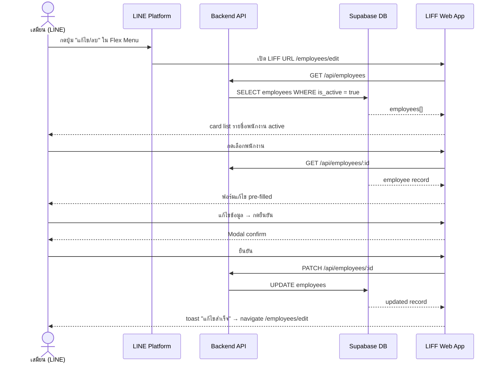

# JASS Payroll LINE OA — Technical Specification

**Version:** 1.1  
**Date:** 2026-04-28  
**Author:** Angela  
**Related PRD:** PRD.md

---

## 1. Summary

Spec นี้ครอบคลุม architecture, data model, API design, และ LINE integration flow ของระบบ jass-payroll-lineoa — ระบบลงเวลาและคำนวณเงินเดือนผ่าน LINE OA สำหรับ single organization

---

## 2. System Design

### 2.1 Architecture Overview

```
LINE App (User)
    │
    │ (1) ส่งข้อความ / กดปุ่ม Flex
    ▼
LINE Platform
    │
    │ (2) POST /webhook/line (signed)
    ▼
Backend (Express + TypeScript)
    ├── Middleware: verifyLineSignature
    ├── Router: lineWebhookRouter
    ├── Handler: handleLineEvent
    │       ├── Intent Detection (text matching)
    │       └── dispatch → Service Layer
    │
    ├── Module Layer (per feature)
    │       ├── employees/ (controller, service, repository, route)
    │       ├── periods/   (controller, service, repository, route)
    │       └── attendance/(controller, service, repository, route)
    │
    └── Repository Layer (Supabase client)

LIFF (React + Vite)
    │
    │ (3) User กด LIFF URL ใน LINE
    ▼
Web App (React)
    ├── Pages (Employee CRUD, Attendance, Period)
    └── POST/GET /api/* → Backend REST API
```

### 2.2 Module Structure

| Module | Files | Responsibility |
|--------|-------|----------------|
| employees | controller, service, repository, route | CRUD พนักงาน + คำนวณ ot_rate |
| periods | controller, service, repository, route | สร้างงวด, หางวด active |
| attendance | controller, service, repository, route | บันทึกเวลา, หาวันที่ขาด, upsert batch |

---

## 3. Data Model (Actual Schema)

### 3.1 ER Diagram



### 3.2 SQL Schema

```sql
-- employees
create table employees (
  employee_id  int generated always as identity primary key,
  first_name   text          not null,
  last_name    text          not null,
  wage         numeric(10,2) not null check (wage >= 0),
  ot_rate      numeric(10,2) not null check (ot_rate >= 0),
  is_active    boolean       not null default true,
  created_at   timestamptz   not null default now(),
  updated_at   timestamptz   not null default now()
);

-- periods
create table periods (
  period_id   int generated always as identity primary key,
  start_date  date        not null,
  end_date    date        not null,
  is_active   boolean     not null default true,
  created_at  timestamptz not null default now(),
  constraint periods_date_check check (end_date >= start_date)
);

-- attendance
create table attendance (
  attendance_id    int generated always as identity primary key,
  attendance_date  date             not null,
  employee_id      int              not null references employees(employee_id),
  period_id        int              not null references periods(period_id),
  morning_check    boolean          not null default false,
  afternoon_check  boolean          not null default false,
  ot               double precision not null default 0 check (ot >= 0),
  created_at       timestamptz      not null default now(),
  constraint attendance_unique unique (attendance_date, employee_id, period_id)
);

-- tasks
create table tasks (
  task_id       int generated always as identity primary key,
  task_date     date        not null,
  task          text        not null,
  detail        text,
  employee_ids  text        not null,
  created_at    timestamptz not null default now()
);
```

### 3.3 Business Rules

- `ot_rate` คำนวณอัตโนมัติตอนสร้าง/แก้ไข employee: `wage / 8 × 1.5`
- "งวด active" = `is_active = true AND today BETWEEN start_date AND end_date`
- OT เก็บเป็น decimal hours (เช่น 1.5 = 1 ชม. 30 น.) — UI แสดงเป็น 2 input (ชม./น.) แล้ว convert
- attendance มี unique constraint ต่อ (date, employee, period) → ใช้ upsert ได้

---

## 4. API Endpoints

### 4.1 REST (ใช้กับ LIFF)

| Method | Path | Description |
|--------|------|-------------|
| GET | `/api/employees` | รายชื่อพนักงาน active ทั้งหมด |
| POST | `/api/employees` | สร้างพนักงานใหม่ |
| GET | `/api/employees/:id` | ดูพนักงาน 1 คน |
| PATCH | `/api/employees/:id` | แก้ไขข้อมูลพนักงาน |
| DELETE | `/api/employees/:id` | deactivate พนักงาน |
| GET | `/api/periods/active` | หางวดที่ active ณ วันนี้ → `{ period: Period \| null }` |
| POST | `/api/periods` | สร้างงวดใหม่ `{ start_date, end_date }` |
| GET | `/api/attendance/missing-dates?period_id=X` | วันที่ในงวดที่ยังไม่มีข้อมูล attendance → `string[]` |
| GET | `/api/attendance?period_id=X&date=Y` | ดู attendance ของวันที่ระบุในงวด → `Attendance[]` |
| POST | `/api/attendance/batch` | upsert attendance ทุกพนักงานสำหรับวันที่ระบุ |
| GET | `/health` | Health check |
| POST | `/webhook/line` | LINE webhook |

### 4.2 Request/Response Schemas

**POST /api/attendance/batch**
```json
{
  "period_id": 1,
  "attendance_date": "2026-04-28",
  "records": [
    {
      "employee_id": 1,
      "morning_check": true,
      "afternoon_check": false,
      "ot": 1.5
    }
  ]
}
```

**POST /api/periods**
```json
{ "start_date": "2026-04-01", "end_date": "2026-04-30" }
```

---

## 5. LINE Message Flow

### 5.1 Intent Trigger Map

| User พิมพ์ | Intent | Action |
|-----------|--------|--------|
| `>พนักงาน` | EMPLOYEE_MENU | แสดง Flex: รายชื่อ / สร้าง / แก้ไข |
| `>รายชื่อ` | LIST_EMPLOYEES | reply text list พนักงาน active |
| `>ลงเวลา` | ATTENDANCE_WEBVIEW | reply Flex พร้อมปุ่มเปิด LIFF `/attendance` |

### 5.2 Sequence: ลงเวลางาน



### 5.3 Sequence: จัดการพนักงาน



---

## 6. Security

- **LINE Signature Verification:** ทุก request ที่ `/webhook/line` ต้อง verify `x-line-signature` ด้วย HMAC-SHA256 — ใน `signature.ts` (ยังไม่ wire เป็น middleware)
- **Supabase Service Role:** Backend ใช้ `SUPABASE_SERVICE_ROLE_KEY` เท่านั้น
- **Input Validation:** ใช้ Zod validate ทุก request body ก่อนถึง service layer
- **Role Guard:** ยังไม่ implement — เพิ่มใน Phase 3

---

## 7. Key Decisions & Tradeoffs

| Decision | เลือก | เหตุผล |
|----------|-------|--------|
| DB PK | `int generated always as identity` | ง่ายกว่า UUID, เพียงพอสำหรับ single org |
| Employee wage | `wage` (รายวัน) เท่านั้น | ทีมนี้ทุกคนเป็นรายวัน — ไม่ต้องการ wage_type ใน v1 |
| ot_rate | คำนวณใน app (`wage/8×1.5`) | ไม่ใช้ GENERATED column — ง่ายกว่า, update ได้ตาม wage |
| Period status | `is_active boolean` | เรียบง่ายกว่า `status enum` สำหรับ open/locked ใน v1 |
| missing-dates | คำนวณใน service layer | เอา range ทั้งหมด − logged dates = missing |
| OT storage | `double precision` hours | เก็บ decimal (1.5 = 1h30m), UI แสดง 2 input ชม./น. |
